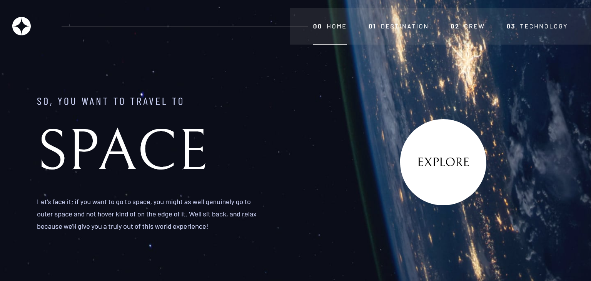

# Frontend Mentor - Space tourism website solution

This is a solution to the [Space tourism website challenge on Frontend Mentor](https://www.frontendmentor.io/challenges/space-tourism-multipage-website-gRWj1URZ3). Frontend Mentor challenges help you improve your coding skills by building realistic projects. 

## Table of contents

- [Overview](#overview)
  - [The challenge](#the-challenge)
  - [Screenshot](#screenshot)
  - [Links](#links)
- [My process](#my-process)
  - [Built with](#built-with)
  - [What I learned](#what-i-learned)
  - [Continued development](#continued-development)
  - [Useful resources](#useful-resources)
- [Author](#author)

## Overview

### The challenge

Users should be able to:

- View the optimal layout for each of the website's pages depending on their device's screen size
- See hover states for all interactive elements on the page
- View each page and be able to toggle between the tabs to see new information

### Screenshot



### Links

- Solution URL: [Frontend Mentor](https://www.frontendmentor.io/solutions/responsive-landing-page-using-nuxt-and-tailwind-css-FTrgtuaEA)
- Live Site URL: [Netlify hosted webpage](https://thirsty-archimedes-a0d572.netlify.app/)

## My process

### Built with

- Semantic HTML5 markup
- Mobile-first workflow
- [VueJS](https://vuejs.org/) - JS library
- [Nuxt](https://nuxtjs.org/) - Vue framework
- [Tailwind CSS](https://tailwindcss.com/) - For styling

### What I learned

```tailwind
<div class="md:text-left grid col-span-6 col-start-4 md:order-3 md:col-span-10 md:col-start-3 lg:col-span-4 lg:row-span-5">
  
</div>
```
```css
.underlined, .nuxt-link-exact-active {
  position: relative;
}

.underlined::after { 
  content: "";
  position: absolute;
  top: 240%;
  display: block;
  height: 2px;
  background: #979797;
}

.top-header .nuxt-link-exact-active::after { 
  background: white;
  content: "";
  position: absolute;
  top: 240%;
  display: block;
  height: 2px;
  width: 100%; 
}

.underlined:hover::after { 
  width: 100%; 
  left: 0; 
}
```

### Continued development

Improve on how to make it so that the background image doesn't get cut off in some screens and improve responsiveness.

### Useful resources

- [Tailwind playground](https://play.tailwindcss.com/) - Testing out tailwind classes.

## Author

- Website - [Constantino Saldana](https://www.csaldana.xyz)
- Frontend Mentor - [@antinomezco](https://www.frontendmentor.io/profile/antinomezco)